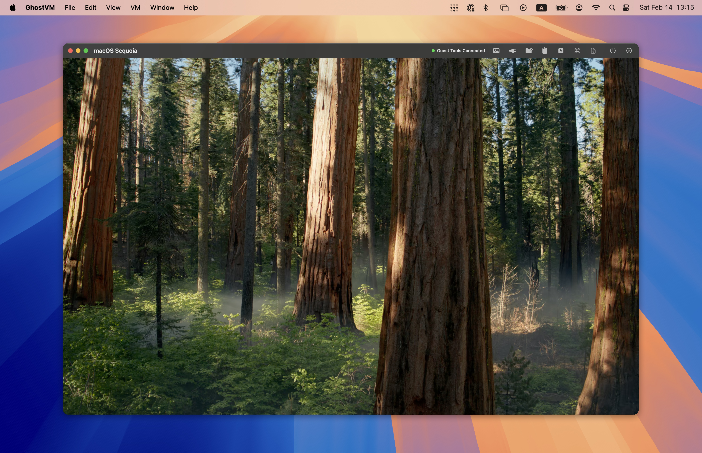

<p align="center">
  
</p>

<h1 align="center">GhostVM</h1>

<p align="center">
  <strong>Isolated macOS workspaces for agents, projects, and clients</strong>
</p>

<p align="center">
  
  &nbsp;
  
  &nbsp;
  
</p>

<p align="center">
  <a href="https://ghostvm.org">Website</a> •
  <a href="https://ghostvm.org/docs/getting-started">Documentation</a> •
  <a href="https://github.com/groundwater/GhostVM/releases/latest">Download</a>
</p>

---

<p align="center">
  
</p>

GhostVM is a native macOS app for creating and managing macOS virtual machines on Apple Silicon using Apple's `Virtualization.framework`. Each VM is stored as a self-contained `.GhostVM` bundle that you can copy, move, or back up like any file.

**Perfect for:** AI agent sandboxing, disposable dev environments, testing across macOS versions, and isolating client work.

## Features

- **Native Performance** — Near-native speed with Apple's Virtualization.framework
- **Self-Contained Bundles** — Each workspace is a portable `.GhostVM` folder
- **Snapshots & Clones** — Checkpoint and clone instantly with APFS copy-on-write
- **Deep Host Integration** — Clipboard, files, folders, and automatic port forwarding
- **Scriptable** — Full CLI (`vmctl`) and Unix socket API for automation

## Installation

<p align="center">
  <a href="https://github.com/groundwater/GhostVM/releases/latest">
    
  </a>
</p>

1. Download the latest DMG from the [releases page](https://github.com/groundwater/GhostVM/releases/latest)
2. Open the DMG and drag **GhostVM.app** to your Applications folder
3. Launch GhostVM and create your first workspace

**Requirements:** macOS 15+ (Sequoia) on Apple Silicon (M1 or later)

## CLI Usage

The `vmctl` command-line tool provides full control over GhostVM virtual machines:

```bash
# Create and install a macOS VM
vmctl init ~/VMs/dev.GhostVM --cpus 6 --memory 16 --disk 128
vmctl install ~/VMs/dev.GhostVM
vmctl start ~/VMs/dev.GhostVM

# Manage snapshots
vmctl snapshot ~/VMs/dev.GhostVM create clean-state
vmctl snapshot ~/VMs/dev.GhostVM revert clean-state

# Remote commands (requires GhostTools in guest)
vmctl remote --name dev exec uname -a
vmctl remote --name dev clipboard get
vmctl remote --name dev apps
```

<details>
<summary><strong>All Commands</strong></summary>

| Command | Description |
|---------|-------------|
| `init <bundle>` | Create a new VM bundle (`--cpus`, `--memory`, `--disk`, `--restore-image`) |
| `install <bundle>` | Install macOS from a restore image |
| `start <bundle>` | Launch the VM (`--headless`, `--shared-folder`) |
| `stop <bundle>` | Graceful shutdown |
| `suspend` / `resume` | Suspend and resume VM state |
| `status <bundle>` | Report running state and config |
| `snapshot <bundle> list\|create\|revert\|delete` | Manage snapshots |
| `list` | List all VMs and their status |
| `remote --name <vm> exec <command>` | Run a shell command in the guest |
| `remote --name <vm> clipboard get\|set` | Read or write the guest clipboard |
| `remote --name <vm> apps` | List running guest applications |

</details>

## Building from Source

**Requirements:** Xcode 15+ and [XcodeGen](https://github.com/yonaskolb/XcodeGen)

```bash
brew install xcodegen

git clone https://github.com/groundwater/GhostVM.git
cd GhostVM
make app
```

<details>
<summary><strong>Build Targets</strong></summary>

| Target | Description |
|--------|-------------|
| `make app` | Build GhostVM.app |
| `make cli` | Build vmctl CLI |
| `make test` | Run unit tests |
| `make run` | Build and run attached to terminal |
| `make launch` | Build and launch detached |
| `make dist` | Create distribution DMG |
| `make clean` | Remove build artifacts |

</details>

## Notes

- VMs use NAT networking via `VZNATNetworkDeviceAttachment`
- Shared folders use VirtioFS via `VZVirtioFileSystemDeviceConfiguration`
- GhostTools provides clipboard sync, file transfer, and port discovery
- Apple's EULA requires macOS guests to run on Apple-branded hardware

## Project Structure

```
.
├── Makefile              # Build orchestration
├── macOS/
│   ├── project.yml       # XcodeGen project definition
│   ├── GhostVM/          # Main SwiftUI app (VM manager/launcher)
│   ├── GhostVMHelper/    # Per-VM helper process (display, toolbar, services)
│   ├── GhostVMKit/       # Shared framework (types, VM controller, utilities)
│   ├── GhostTools/       # Guest agent (runs inside VM, vsock communication)
│   └── GhostVMTests/     # Unit tests
└── Website/              # Documentation site (ghostvm.org)
```
